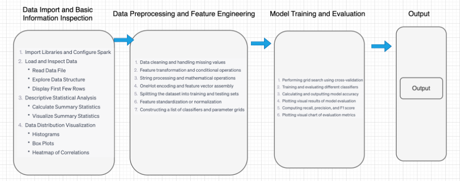
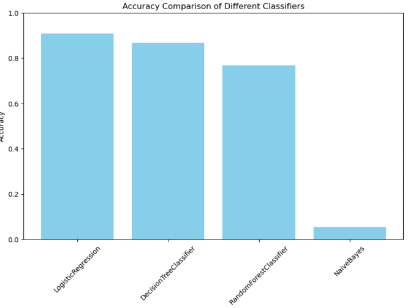

# Analyzing Fetal Health through Big Data - Predicting Fetal Health Classification

## Abstract
Cardiotocography (CTG) plays a vital role in monitoring fetal heart rate and uterine contractions throughout pregnancy. Its purpose is to ensure the well-being of unborn babies and to enable early identification of potential fetal distress. Interpreting CTG data aids in categorizing pregnancy risk levels, enabling the identification of abnormalities that may necessitate further investigations and timely medical interventions [1].
However, the analysis of intricate relationships among diverse medical parameters presents challenges because of the extensive amount, diversity, and speed of generated data.
The primary objective of this project is to showcase the application of advanced analytical techniques, utilizing both Hive and PySpark, on a real-world dataset pertaining to fetal health monitoring. By harnessing the capabilities of big data tools, this initiative addresses the formidable challenge of effectively analyzing extensive medical data to accurately predict fetal health conditions. Through this undertaking, medical professionals are empowered to proactively manage fetal well-being based on data-driven insights.

## DATA ANALYSIS
The analysis consist of:

* Count Plot
* Corelation Heat Map
* Implot
* Swarm And Boxen Plot

## Overall processing flow

## Accuracy comparison chart
| Classifier                           | Accuracy | Precision | Recall | F1-Score |
|--------------------------------------|----------|-----------|--------|----------|
| Logistic Regression                  | 0.91     | 0.91      | 0.91   | 0.91     |
| Decision Trees                       | 0.87     | 0.87      | 0.86   | 0.86     |
| Random Forests                       | 0.77     | 0.77      | 0.59   | 0.67     |
| Naive Bayes                          | 0.54     | 0.54      | 0.21   | 0.08     |
| Cross-validated Logistic Regression  | 0.91     | 0.91      | 0.91   | 0.91     |
| Cross-validated Decision Trees       | 0.87     | 0.87      | 0.86   | 0.86     |
| Cross-validated Random Forests       | 0.77     | 0.77      | 0.60   | 0.67     |
| Cross-validated Naive Bayes          | 0.54     | 0.54      | 0.21   | 0.09     |

## Cross-validated

